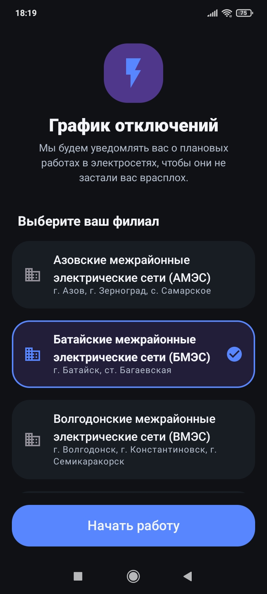
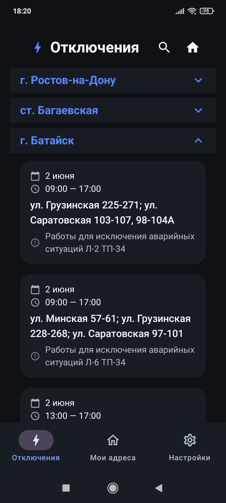

# Outage Schedule (Отключения ДонЭнерго)

Приложение для мониторинга плановых отключений электроэнергии поставщиком «ДонЭнерго».

## 📱 Скриншоты
 <table style="width: 100%">
   <tr>
     <td style="width: 33%"></td>
     <td style="width: 33%"></td>
   </tr>
 </table>

## 📱 Основные возможности:
*   **Актуальные данные:** Синхронизация расписания отключений с официального сайта «ДонЭнерго».
*   **Удобный поиск:** Быстрая фильтрация записей по филиалам и адресам.
*   **Сохранение мест:** Добавление адресов для отслеживания отключений.
*   **Уведомления:** Оповещения о новых запланированных отключениях.

## 🚀 Установка
Скачайте и установите APK-файл: **[Releases](https://github.com/Chumakov123/donenergo-outage-schedule/releases)**.
